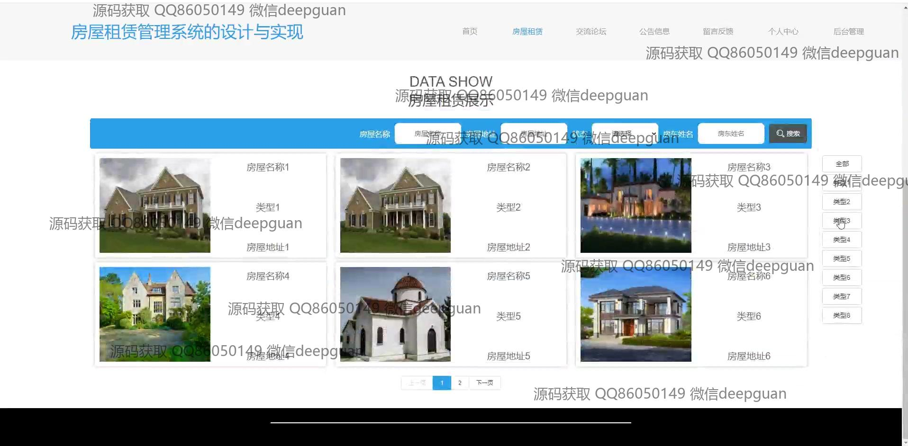
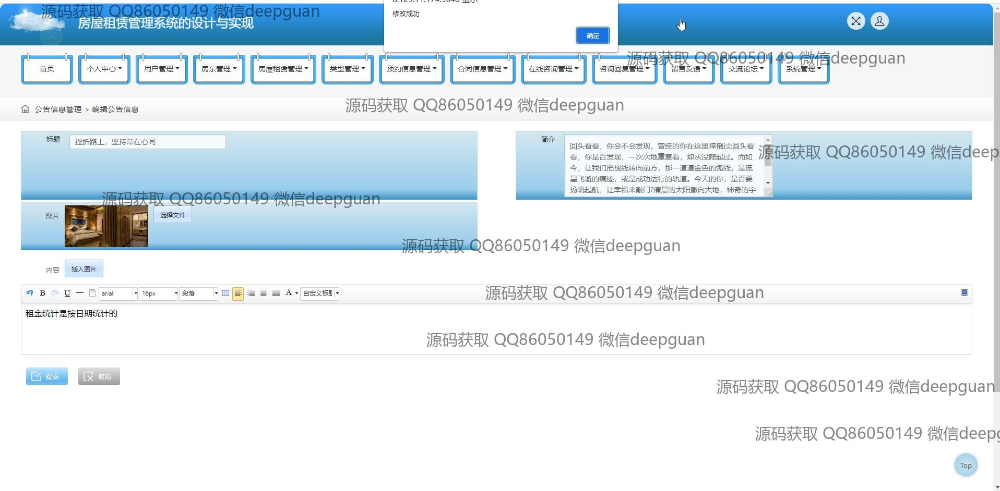

<h1 align="center">房屋租赁管理系统的设计与实现</h1>

## 简介
房屋租赁管理系统：角色分为管理员、用户、房东；功能包括房源管理、租客管理、合同信息管理、在线咨询、支付、公告信息管理、交流论坛。    --计算机毕业设计源码；毕设源码；java毕业设计源码

## 联系方式

<h3 align="center">获取完整代码与数据库文件 + 微信：deepguan QQ: 86050149 QQ群: 783742310</h3>

<h3 align="center">可帮忙远程部署 包运行成功！提供远程部署、修改代码、设计文档指导、代码讲解等服务！</h3>

## 功能介绍（完整见运行截图）
管理员：基本功能：登录，注册，身份验证，用户管理，房东管理，公告信息管理；系统管理：房屋信息录入、更新与删除，租赁详情审核与合同管理，公告编辑与发布，交流论坛管理，租赁市场数据统计分析。用户操作：房屋预订信息查看与审核，留言回复管理，在线咨询管理，支付信息查看。

房东：基本功能：注册，登录，个人信息修改；房屋管理：房屋状态更新，房源信息录入或编辑，房东联系信息管理，房屋照片上传；租赁管理：合同信息输入，租金设置，预约信息管理，租赁咨询回复，查看租赁审核结果。

用户：基本功能：注册，登录，个人中心信息更新；房屋租赁：房屋信息浏览，租赁详情查看，预订申请提交；信息管理：合同信息查看，预约管理，在线咨询与留言反馈；支付功能：选择支付方式并完成租金支付。

访客：首页浏览：房屋租赁信息查看，导航栏模块功能探索；交流平台：查看与参与论坛话题，留言反馈；其他信息：公告内容浏览，房屋租赁相关政策与公告消息阅读，无需帐户注册即可了解基本系统功能。

## 运行截图

本代码来源于网络,仅供学习参考使用!

